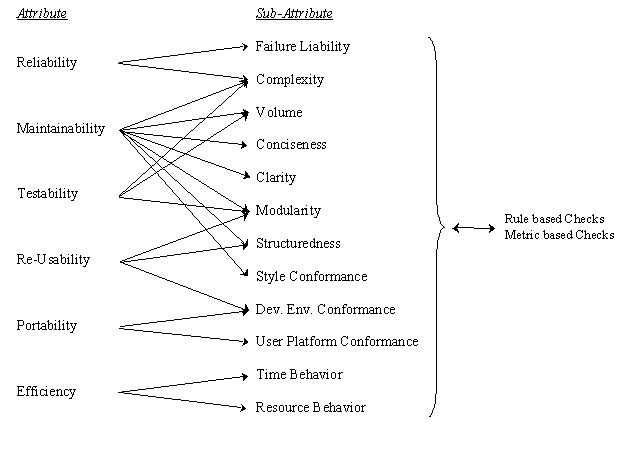

#### SW defects

##### Types of Defects
incorrect : requirement is innacurately implemented

missing : a requirement wasn't fulfilled

extra: a requiment was incorporated but not originally required

error: mistake/misconception/misunderstanding at the implementation level

bug: SW related error (in the context of SW test) at the implementation of the system or third party tooold

failure: inability of system to perform its function within the performance requirements

fault: incorrect step/process/data definition in a program which causes unintended or unanticipated behaviour. Faults are introduced as a result of errors 

&nbsp;

***

##### Code Quality

* __Reliability__ impacted by:
  * Failure Liability
  * Complexity

* __Testability__ impacted by:
  * Modularity
  * Volume (LOCs)
  * Complexity

* __Efficiency__ impacted by:
  * time behaviour
  * resource behaviour

&nbsp;

***

&rarr; Data flow anomalies

    * UR anomaly (undef ref) - a reference to a variable that was not defined before
    * DU anomaly (def undef) - a recently defined variable is undefined
    * DD anomaly (def def)   - a recently defined variable is redefined (may be harmless but technically incorrect)

&nbsp;

***
&rarr; Complexity

   metrics:
  * Static path count
  * Cyclomatic complexity
    *  1-4 low 
    *  5-7 moderate 
    *  8-10 high
    *  11+ very high complexity 
  * nesting depth
  * inheritance depth (what year is this?!)
  * Weighted method complexity

